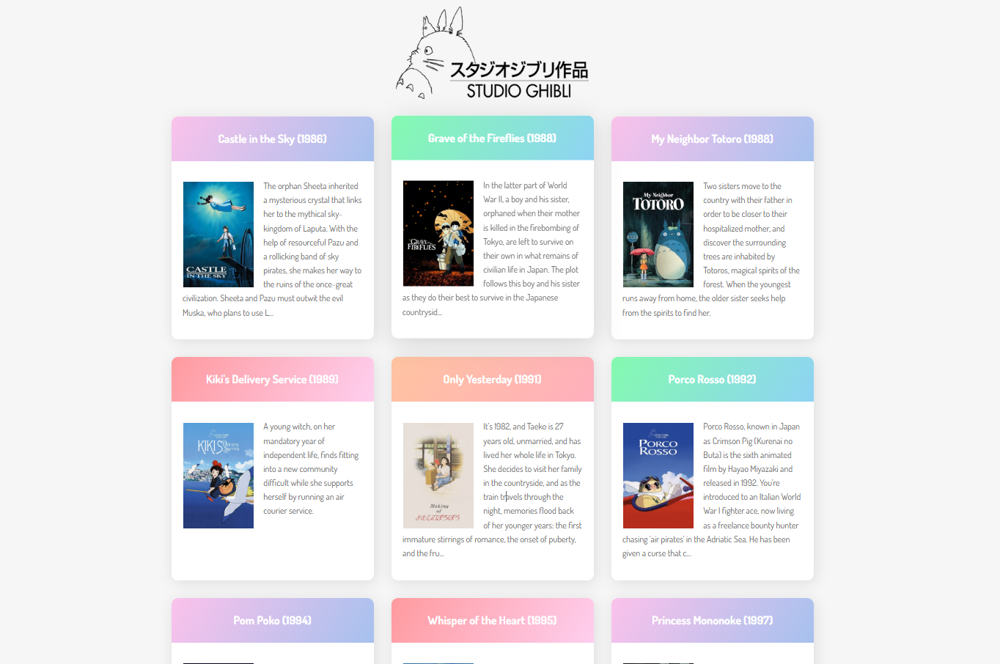

# Studio Ghibli Films App

> A vanilla JavaScript app that fetches and displays films from the [Studio Ghibli API](https://ghibliapi.vercel.app).


🔗 **[Live Demo](https://ghibli-web-app.netlify.app/)**



## About

My first ever JavaScript project, built to understand how APIs work and how to read and display data from an external source. No frameworks, no libraries. Just vanilla JS and `XMLHttpRequest`. Keeping it simple on purpose: the goal was to understand the fundamentals before moving on to React.

## Features

- 🎬 Browse all Studio Ghibli films in a responsive card grid
- 📋 Each card shows the film poster, title, director and release year
- 🌐 Data fetched live from the Studio Ghibli API

## Tech Stack

| Layer | Technology |
|-------|-----------|
| Language | Vanilla JavaScript (ES6) |
| HTTP | XMLHttpRequest |
| Styles | CSS3 |
| Data | Studio Ghibli API |
| Deployment | Netlify |

## Getting Started

```bash
git clone https://github.com/ajsevillano/Ghibli-Studio-WebApp.git
cd Ghibli-Studio-WebApp
```

Open `index.html` in your browser. No build step needed.

> **Note:** Film posters are not included in the repo. To display them locally, download each poster and save it in the `img/` folder using the film title as the filename (e.g. `Spirited Away.jpg`).

## Contributing

Found a bug or have an idea? Feel free to open an issue.

## License

MIT
